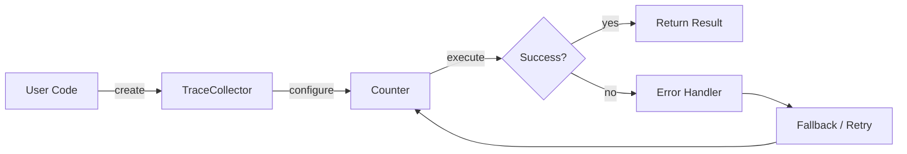
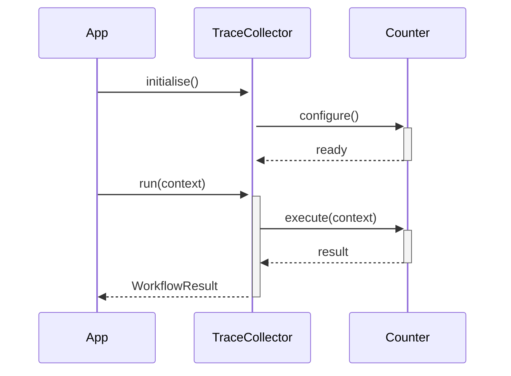

<div align="center">

</div>

# agent-telemetry

**Lightweight stdlib-only metrics collection and export for LLM agents**

[](https://pypi.org/project/agent-telemetry/) [](https://python.org) [](LICENSE) [](#)

---

## The Problem

Without telemetry, LLM agents are black boxes. Latency spikes, token overruns, and error-rate degradations are invisible until a user complains. By then, the incident has been running for hours with no trace to diagnose it.

## Installation

```bash
pip install agent-telemetry
```

## Quick Start

```python
from agent_telemetry import TraceCollector, Counter, Gauge

# Initialise
instance = TraceCollector(name="my_agent")

# Use
result = instance.run()
print(result)
```

## API Reference

### `TraceCollector`

```python
class TraceCollector:
    """
    def __init__(self, max_traces: int = 1000) -> None:
    def collect(self, span: Span) -> None:
        """Store a completed span."""
```

### `Counter`

```python
class Counter:
    """Monotonically increasing counter metric."""
    def __init__(self, name: str, labels: Optional[dict] = None) -> None:
    def increment(self, by: float = 1.0) -> None:
    def value(self) -> float:
    def reset(self) -> None:
```

### `Gauge`

```python
class Gauge:
    """Current-value metric that can go up or down."""
    def __init__(self, name: str, labels: Optional[dict] = None) -> None:
    def set(self, value: float) -> None:
    def increment(self, by: float = 1.0) -> None:
    def decrement(self, by: float = 1.0) -> None:
```


## How It Works

### Flow



### Sequence



## Philosophy

> The Gita asks us to observe the field (*kshetra*) without attachment; telemetry is witness-consciousness for code.

---

*Part of the [arsenal](https://github.com/darshjme/arsenal) — production stack for LLM agents.*

*Built by [Darshankumar Joshi](https://github.com/darshjme), Gujarat, India.*
